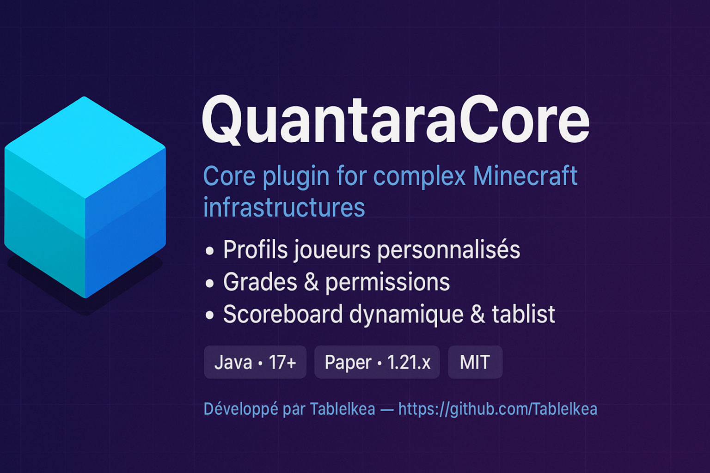

  

# 🚀 QuantaraCore

**QuantaraCore** est un plugin Minecraft *core* conçu pour gérer des profils joueurs personnalisés, des grades, des annonces, des statistiques, un scoreboard dynamique et une tablist améliorée. Parfait pour des infrastructures serveur complexes.

---

## ✨ Fonctionnalités

- 🎮 **Gestion des profils joueurs** : création, suppression, vérification
- 🎖️ **Système de grades** : attribution et gestion
- 📢 **Annonces en jeu** : messages personnalisés
- 📊 **Suivi des statistiques** : temps de jeu, kills, etc.
- ⏱️ **Scoreboard dynamique** : mise à jour automatique toutes les 5 minutes
- 📋 **Tablist améliorée** : affichage personnalisé avec tri par grade

---

## ⚙️ Commandes

| Commande             | Description                                              |
|----------------------|----------------------------------------------------------|
| `/checkprofil`       | Vérifier le profil d'un joueur                            |
| `/color`             | Gérer les couleurs (probablement pour les messages ou grades) |
| `/createprofil`      | Créer un profil joueur de force                           |
| `/removeprofil`      | Supprimer un profil joueur de force                       |
| `/mod`               | Commandes de modération (usage spécifique à définir)     |
| `/perm`              | Gérer les permissions ou les grades                      |
| `/reloadconfig`      | Recharger la configuration du plugin                     |
| `/resetstatistic`    | Réinitialiser les statistiques d'un joueur                |
| `/restartserver`     | Redémarrer le serveur Minecraft                           |
| `/updatescoreboard`  | Mettre à jour le scoreboard de tous les joueurs           |

---

## 🚀 Installation

1. Télécharge le fichier `.jar` depuis la page [Releases](https://github.com/Tablelkea/QuantaraCore/releases).
2. Place le fichier `.jar` dans le dossier `plugins` de ton serveur.
3. Démarre ou redémarre ton serveur Minecraft.
4. Modifie le fichier `config.yml` selon tes besoins.

---

## 🛠️ Utilisation

- Les profils joueurs sont créés et gérés automatiquement lors de leur connexion ou déconnexion.
- Utilise les commandes ci-dessus pour gérer les profils, les grades, les annonces et les paramètres du serveur.
- Le scoreboard et la tablist se mettent à jour automatiquement toutes les 5 minutes. Tu peux forcer une mise à jour avec `/updatescoreboard`.
- Active le mode débogage via l'option `settings.debug_mode` dans le fichier de configuration pour obtenir des logs détaillés.

---

## 📋 Prérequis

- Serveur Minecraft fonctionnant sous **Paper 1.21.x** ou une version compatible.
- **Java 17** ou une version supérieure.

---

## 🤝 Contribuer

Les contributions sont les bienvenues ! Ouvre une issue ou soumets une pull request pour signaler des bugs, proposer des fonctionnalités ou améliorer le plugin.

---

## 📄 Licence

Ce projet est sous licence **MIT**.

---

*Développé par [Tablelkea](https://github.com/Tablelkea)
[Lorenzo](https://github.com/Lorenzo605)*

